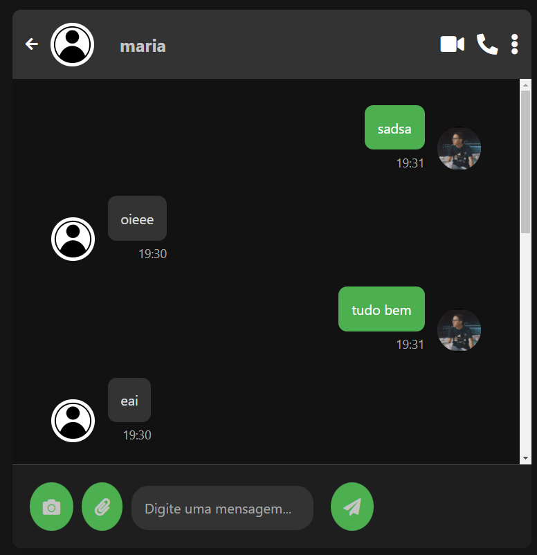

# Social Network with Django


## Sobre o projeto

Esta é uma rede social desenvolvida com Django e Django Channels, onde os usuários podem criar perfis, enviar mensagens em tempo real para outros usuários, compartilhar posts, comentar, curtir, e seguir outros usuários. A aplicação foi projetada para ser escalável e segura, utilizando as melhores práticas de desenvolvimento web.

## Layout
### Registro

### Usuarios

### chat


## Features

### Autenticação de Usuários
O sistema permite que os usuários se registrem e façam login utilizando autenticação baseada em e-mail e senha. Implementei diversas validações de formulario para garantir que apenas usuários reais possam acessar a plataforma.

### Perfis de Usuários
Cada usuário tem um perfil personalizável, onde pode adicionar uma foto, nome de usuario e senha. Esses perfis permitem que outros usuários sigam e acompanhem as atividades na rede.

### Postagens e Feed de Notícias
Os usuários podem criar postagens que aparecem no feed, adicionando foto titulo e legenda, alem do mais tambem é possivel ver a data e horario da postagem.

### Sistema de Curtidas e Comentários
Cada post pode ser curtido pelos usuários e o número de curtidas tambem é exibido , e o usuário pode curtir ou descurtir um post.
Os usuários podem comentar em qualquer post,os comentários são exibidos em ordem cronológica.


## Mensagens em Tempo Real
A funcionalidade de mensagens em tempo real é o principal destaque desta rede social. Implementada para oferecer uma experiência de comunicação instantânea e fluida entre os usuários, a solução foi construída utilizando Django Channels e  WebSockets. Essa integração permite que os usuários troquem mensagens de forma síncrona, sem necessidade de recarregar a página.
### implementação do chat em tempo real
Um ChatConsumer foi criado para gerenciar a comunicação via WebSocket. O ChatConsumer lida com o envio e recebimento de mensagens em tempo real.Alem de salvar no banco de dados as mensagens
```python
class ChatConsumer(AsyncWebsocketConsumer):
    async def connect(self):
        self.room_name = f"room_{self.scope['url_route']['kwargs']['room_name']}"
        await self.channel_layer.group_add(self.room_name, self.channel_name)
        await self.accept()

    async def disconnect(self, close_code):
        await self.channel_layer.group_discard(self.room_name, self.channel_name)

    async def receive(self, text_data):
        text_data_json = json.loads(text_data)
        message_id = text_data_json.get('message_id', str(uuid.uuid4()))
        message = text_data_json
        sender = message['sender']
        receive = message['receive']
        room_name = text_data_json.get('room_name')
        data = {
            'message_id': message_id,
            'message': message,
            'room_name': room_name,
            'sender': sender,
            'receive': receive
        }
        event = {
            'type': 'send_message',
            'message': message,
        }
        await self.channel_layer.group_send(self.room_name, event)

    async def send_message(self, event):
        data = event['message']
        await self.create_message(data=data)
        response_data = {
            'sender': data['sender'],
            'message': data['message']
        }
        await self.send(text_data=json.dumps({'message': response_data}))

    @database_sync_to_async
    def create_message(self, data):
        get_room_by_name = Room.objects.get(room_name=data['room_name'])
        message_id = data['message_id']
        if not Message.objects.filter(message_id=message_id).exists():
            message_original = data['message']
            message_bytes = message_original.encode('utf-8')
            message_encrypted = f.encrypt(message_bytes)
            message_decoded = message_encrypted.decode('utf-8')
            new_message = Message(
              room=get_room_by_name,
              sender=data['sender'],
              message=message_decoded,
              message_id=message_id
            )
            new_message.save()
```

### Gerenciamento de WebSockets
O cliente WebSocket é gerenciado em JavaScript. Ele lida com a conexão WebSocket, envio e recebimento de mensagens e atualização da interface do usuário.
```javascript
const websocketProtocol = window.location.protocol === "https:" ? "wss" : "ws";
var room_name = "{{ room_name }}";
const wsEndpoint = `${websocketProtocol}://${window.location.host}/ws/notification/${room_name}/`;
const socket = new WebSocket(wsEndpoint);

socket.onopen = (event) => {
    console.log("WebSocket connection opened!");
};

socket.onclose = (event) => {
    console.log("WebSocket connection closed!");
};

document.getElementById('message-form').addEventListener('submit', function(event){
    event.preventDefault();
    const message = document.getElementById('msg').value;
    const messageId = uuidv4();
    socket.send(
        JSON.stringify({
            'message_id': messageId,
            'message': message,
            'room_name': '{{room_name}}',
            'sender': '{{ request.user.username }}',
            'receive': '{{ receive }}'
        })
    );
    document.getElementById('msg').value = '';
});

socket.addEventListener("message", (event) => {
    const messageData = JSON.parse(event.data)['message'];
    var sender = messageData['sender'];
    var message = messageData['message'];
    var messageDiv = document.querySelector('.chat-messages');
    if (sender != '{{ request.user.username }}') {
        messageDiv.innerHTML += '<div class="message received">' +
                                        '' +
                                    '<div class="message-content-wrapper">' +
                                        '<div class="message-content">' + message + '</div>' +
                                        '<div class="message-time">19:30</div>' +
                                    '</div>' +
                                '</div>';
    } else {
        messageDiv.innerHTML += '<div class="message sent">' +
                                    '' +
                                    '<div class="message-content-wrapper">' +
                                        '<div class="message-content">' + message + '</div>' +
                                        '<div class="message-time">19:31</div>' +
                                    '</div>' +
                                '</div>';
    }
    scrollToBottom();
});
```

## Criptografia das Mensagens
Para garantir a privacidade e a segurança das comunicações entre os usuários, foi implementada uma camada de criptografia das mensagens utilizando a biblioteca cryptography e o algoritmo Fernet. A criptografia é aplicada a cada mensagem antes de ser armazenada no banco de dados, e a descriptografia é feita quando a mensagem é enviada de volta para os usuários.
### Criptografia com Fernet
O Fernet é uma implementação de criptografia simétrica que usa uma chave para cifrar e decifrar dados. Cada mensagem é convertida em bytes, criptografada e então armazenada de forma segura.
Ao receber uma mensagem, ela é descriptografada utilizando a mesma chave, garantindo que apenas os destinatários autorizados possam ler o conteúdo da mensagem.
```python
  message_bytes = message_original.encode('utf-8')
  message_encrypted = f.encrypt(message_bytes)
  message_decoded = message_encrypted.decode('utf-8')
  new_message = Message(
    room=get_room_by_name,
    sender=data['sender'],
    message=message_decoded,
    message_id=message_id
  )
  new_message.save()
```

### Segurança
Implementei tambem  práticas de segurança como criptografia de dados, proteção contra CSRF, e validações rigorosas de entradas para evitar injeção de SQL e XSS.


## Tecnologias usadas

### Backend
- **Django:** Framework principal usado para construir a aplicação, aproveitando sua robustez e flexibilidade.
- **Django Channels:** Extensão de Django para suportar WebSockets, essencial para as mensagens em tempo real.
- **PostgreSQL**

### Frontend
- **HTML e CSS**
- **JavaScript :** Para manipulação dinâmica do DOM e comunicação assíncrona com o backend.
- **WebSockets:** Integrados com Django Channels para fornecer uma experiência em tempo real.


